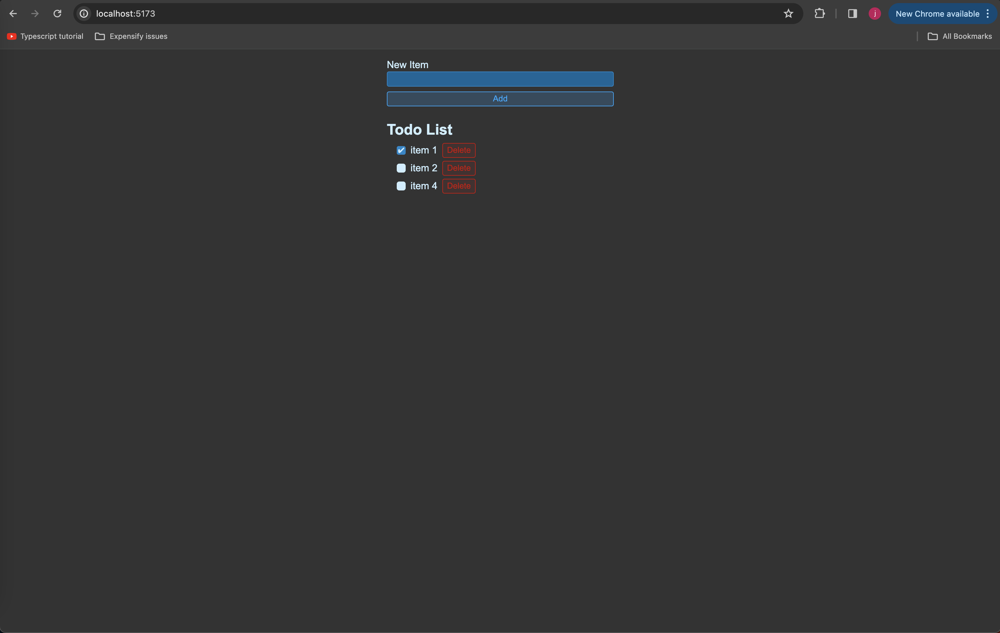

### TODO lists Application using React

The app allows you to add, delete and mark as read a TODO item. The TODO's are stored in local storage so even if you restart the application your TODO's are restored!

#### Steps to run the project

1. Install node version v20.10.0

2. Checkout this repo and inside the vite-project.

3. Install dependencies using `npm install`.

4. Run using npm `run dev`.
